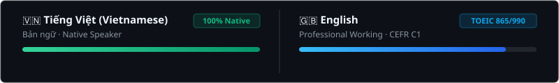

<table width="100%">
  <tr>
    <td width="35%" align="center" valign="middle">
      
    </td>
    <td width="65%" align="center" valign="middle">
      <h1><b>Cap Kim Khanh</b></h1>
      
Software Engineer &middot; AI Engineer

    </td>
  </tr>
</table>

<table width="100%">
  <thead>
    <tr>
      <th width="34%" align="left">&nbsp;BE & FE</th>
      <th width="33%" align="left">&nbsp;AI & Data</th>
      <th width="33%" align="left">&nbsp;DevOps & Infra</th>
    </tr>
  </thead>
  <tbody>
    <tr>
      <td align="left">
        <picture>
          <source media="(prefers-color-scheme: dark)" srcset="https://skillicons.dev/icons?i=django,fastapi,spring,react,nextjs,ts,python&theme=dark" />
          <source media="(prefers-color-scheme: light)" srcset="https://skillicons.dev/icons?i=django,fastapi,spring,react,nextjs,ts,python&theme=light" />
          
        </picture>
      </td>
      <td align="left">
        <picture>
          <source media="(prefers-color-scheme: dark)" srcset="https://skillicons.dev/icons?i=pytorch,tensorflow,postgres,mongodb,redis&theme=dark" />
          <source media="(prefers-color-scheme: light)" srcset="https://skillicons.dev/icons?i=pytorch,tensorflow,postgres,mongodb,redis&theme=light" />
          
        </picture>
      </td>
      <td align="left">
        <picture>
          <source media="(prefers-color-scheme: dark)" srcset="https://skillicons.dev/icons?i=docker,gcp,firebase,nginx,githubactions,git,linux&theme=dark" />
          <source media="(prefers-color-scheme: light)" srcset="https://skillicons.dev/icons?i=docker,gcp,firebase,nginx,githubactions,git,linux&theme=light" />
          
        </picture>
      </td>
    </tr>
  </tbody>
</table>

<picture>
  <source media="(prefers-color-scheme: dark)" srcset="languages-dark.svg" />
  <source media="(prefers-color-scheme: light)" srcset="languages-light.svg" />
  
</picture>

  

  <picture>
    <source media="(prefers-color-scheme: dark)" srcset="https://raw.githubusercontent.com/capkimkhanh2k5/capkimkhanh2k5/output/github-contribution-grid-snake-dark.svg" />
    <source media="(prefers-color-scheme: light)" srcset="https://raw.githubusercontent.com/capkimkhanh2k5/capkimkhanh2k5/output/github-contribution-grid-snake.svg" />
    
  </picture>

